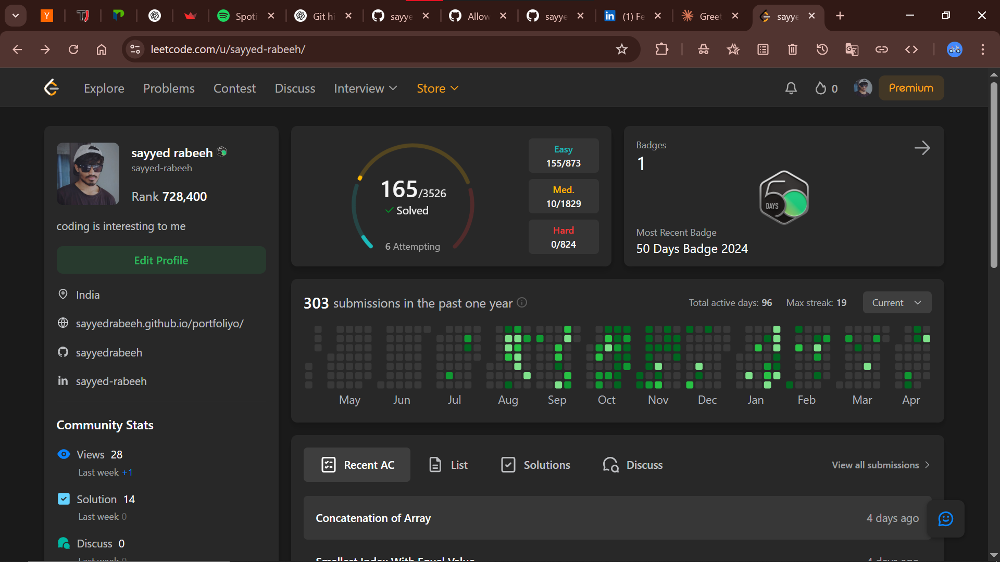

# 🚀 LeetCode Problems & Solutions

## 📚 About This Repository

This repository contains my solutions to various LeetCode problems and Python programming exercises. Each solution includes detailed explanations and optimal approaches to help fellow programmers understand the logic and improve their problem-solving skills.

## 🗂️ Repository Structure

The repository is organized by problem types, with each problem in its own directory:

- **LeetCode Problems** (examples):
  - `buildArray-in-leetcode-main`
  - `kidsWithCandies-in-leetcode-main`
  - `numIdenticalPairs-in-leetcode-main`
  - `numberOfEmployeesWhoMetTarget-in-leetcode-main`
  - `smallerNumbersThanCurrent-in-leetcode-main`
  - `serch-insert-position-leetcode-main`

- **Python Fundamentals & Algorithms**:
  - `recursion--main`
  - `dict-sort-by-key-main`
  - `generator-main`
  - `palindrome-main`

- **Data Structure Implementations**:
  - Lists manipulation (`list-sort-main`, `clear-a-list-main`)
  - Dictionary operations (`merge-two-dict-main`, `max-in-dict-main`)
  - String manipulations (`reverse-a-string-main`, `to-lowercase-main`)

## 🏆 Problem Categories

- **Arrays & Strings**
- **Hash Maps & Dictionaries**
- **Algorithmic Patterns**
- **Mathematical Problems**
- **Pattern Printing** (like `pyramid-traingle-main`, `invert-pyramid-main`)

## 💡 How to Use This Repository

1. **Browse by Topic**: Navigate to the specific problem category you're interested in
2. **Study the Solution**: Each directory contains the full implementation with explanations
3. **Run the Code**: Test the solutions on your local machine to see them in action

## 🔑 Key Features

- **Clean Code**: Readable, well-documented solutions
- **Multiple Approaches**: Where applicable, multiple solutions with time/space complexity analysis
- **Detailed Comments**: Explanations to help understand the thought process
- **Optimized Solutions**: Focus on efficiency and best practices

## 🌱 Contributions

Contributions are welcome! If you have a different approach or want to add a new problem solution:

1. Fork the repository
2. Create your feature branch (`git checkout -b feature/amazing-solution`)
3. Commit your changes (`git commit -m 'Add solution for Problem X'`)
4. Push to the branch (`git push origin feature/amazing-solution`)
5. Open a Pull Request

 

## 🔗 Connect With Me

- [LinkedIn](https://linkedin.com/in/sayyed-rabeeh)
 
---

⭐️ If you find this repository helpful, please consider giving it a star! ⭐️

Happy Coding! 👨‍💻
